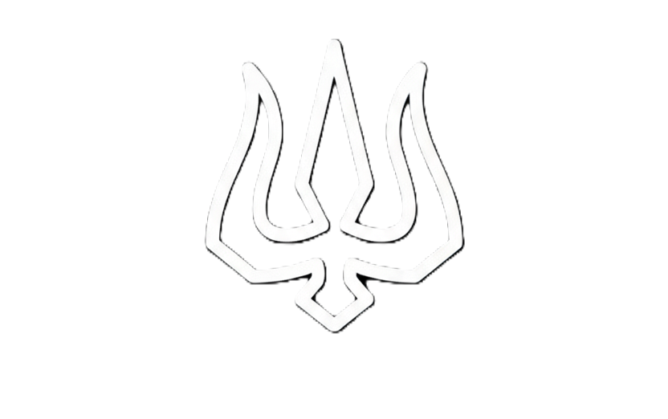

<p align="center">
  
</p>

<h1 align="center">ANARVA — Enter Orbit</h1>

<p align="center">
  <strong>Digital Architecture Studio</strong> · Web · Apps · AI · Product · Web3
</p>

<p align="center">
  <a href="https://anarva.online">Live Site</a> ·
  <a href="mailto:ashapumohan7@gmail.com">Contact</a>
</p>

<p align="center">
  
  
  
  
  
  
</p>

---

## ✦ Overview

**ANARVA** is a premium digital product studio website built as a high-performance, animation-rich Next.js application. The site showcases our portfolio, services, and agency process with a cinematic **cosmic dark theme**, glassmorphism design language, and buttery-smooth 60 fps animations.

> *"We build digital reality."*

---

## ⚡ Tech Stack

| Layer | Technologies |
|---|---|
| **Framework** | Next.js 16 (App Router), React 19, TypeScript 5 |
| **Styling** | Tailwind CSS v4, Custom CSS Design System (Obsidian Palette) |
| **Animation** | Framer Motion 12, GSAP 3.14, Lenis Smooth Scroll |
| **3D / WebGL** | Three.js, React Three Fiber, Drei, React Spring |
| **UI** | Lucide Icons, Custom Glassmorphism Components |
| **Forms** | React Hook Form + Zod Validation |
| **Email** | Nodemailer (server-side contact form) |
| **AI Chatbot** | JSON-driven conversational assistant with lead generation |
| **Fonts** | Inter (body), Syne (display headings), JetBrains Mono (code) |
| **Deployment** | Vercel |

---

## 🗂️ Site Architecture

```
anarva.online
├── /                   → Homepage (Hero + Selected Work + Services)
├── /services           → Full service grid, testimonials, why-choose-us, CTA
├── /process            → "The Protocol" — 5-step development methodology
├── /work               → Portfolio showcase (8 projects with video demos)
├── /about              → Studio story, mission, stats (5+ years, 15+ projects, 12+ countries)
└── /contact            → Multi-step project intake form with budget selection
```

---

## 🎨 Design System

### Cosmic Dark Theme
The entire UI is built on a bespoke **Obsidian palette** — a deep-space-inspired design system:

- **Backgrounds**: `#0a0a0f` (Obsidian), `#050507` (Obsidian Deep)
- **Accents**: `#00e6ff` (Cyber Cyan), `#7b00ff` (Void Purple)
- **Text**: `#f8fafc` (Ghost White) with zinc hierarchy

### Visual Effects
- **Glassmorphism** — frosted-glass cards with `backdrop-blur` and luminous borders
- **Neon glow** — box shadows and text shadows using cyan/purple glow tokens
- **Film grain** — SVG noise overlay across the viewport for cinematic texture
- **Gradient scrollbar** — custom WebKit scrollbar with cosmic gradient thumb

### Animations
| Animation | Effect |
|---|---|
| `float` / `float-slow` | Gentle vertical oscillation with subtle rotation |
| `glow-pulse` | Opacity & blur breathing on glow elements |
| `twinkle` | Star-like scale + opacity pulse |
| `comet` | Diagonal streak across viewport |
| `orbit` / `orbit-reverse` | Circular revolution around a point |
| `blob` | Organic shape morphing |
| `shimmer` | Gradient text shimmer sweep |

---

## 📄 Pages

### 🏠 Homepage
- **Hero section** with two-column layout: headline + CTA buttons on the left, video embed area on the right
- **Selected Work** grid — 4 featured projects with autoplay video cards and hover effects
- **Our Expertise** list — Strategy, Design, Engineering with tag pills

### 🛠️ Services
Six core service domains:
1. **Product Design** — UI/UX, Design Systems, Brand Identity
2. **AI Solutions** — RAG Pipelines, ML Models, Computer Vision
3. **Full-Stack Development** — Next.js, React, Node.js, APIs
4. **Web3 & Blockchain** — Smart Contracts, DeFi, dApps
5. **Growth Engineering** — Analytics, SEO, Performance
6. **Enterprise Security** — Threat Detection, Compliance, Audits

Includes **Why Choose Us** section + **Testimonials** carousel + **CTA** block.

### 🔄 Process — "The Protocol"
A 5-phase methodology presented in a staggered vertical timeline:
1. Discovery & Strategy
2. Wireframing & UX
3. UI Design & Build
4. QA & Testing
5. Launch & Scale

### 💼 Work / Portfolio
**8 case-study projects** with interactive detail views:

| Project | Domain | Key Tech |
|---|---|---|
| VendorSync | AI / Procurement | Next.js, TensorFlow, PostgreSQL |
| CodeViz | EdTech + AI | React, D3.js, WebSocket |
| Alzheimer Early Detection | HealthTech + AI | PyTorch, FastAPI, OpenCV |
| Deriverse Trading Analytics | FinTech + AI | FastAPI, TensorFlow, WebSocket |
| Refino | AI Prompt Engineering | Next.js, OpenAI API |
| CyberSentinel.AI | Security + AI | TensorFlow, Elasticsearch, Kafka |
| Secure Q&A | EdTech + AI (RAG) | LangChain, ChromaDB, FastAPI |
| WikiQuiz | EdTech + AI | NVIDIA NIM, Next.js |

Each project includes: description, tech stack, feature highlights, and a video demo.

### 📖 About
Studio overview with key stats — **5+ years**, **15+ projects**, **12+ countries**, **98% client retention**. Includes the studio mission and a kinetic text animation component.

### 📬 Contact
Multi-step intake form featuring:
- Project type selection (Web, Mobile, Custom Dev, etc.)
- Budget range picker ($0–$50k+)
- Form validation with Zod + React Hook Form
- Server-side email delivery via Nodemailer API route

---

## 🤖 AI Chatbot
A custom-built, JSON-driven conversational assistant available on every page:
- **Knowledge base** powered by `chatbotData.json` (28 KB of structured Q&A)
- **Lead generation** flow — collects name, email, and project needs
- **Brand-consistent UI** — glassmorphism panel with cyber-cyan neon accents
- **Smart routing** — maps user intents to relevant responses about services, pricing, and process

---

## 🧩 Component Library

```
app/components/
├── layout/
│   ├── Navbar.tsx          → Glass-pill desktop nav + fullscreen white mobile menu
│   ├── Footer.tsx          → Site footer with social links
│   └── EasterEggManager.tsx → Hidden interactive easter eggs
├── home/
│   ├── Hero.tsx            → Two-column hero with Framer Motion entrance
│   ├── WorkGrid.tsx        → 2×2 featured project grid with video cards
│   └── ServicesList.tsx    → Expertise breakdown with tag pills
├── sections/
│   ├── FeaturedProjects.tsx → Full project showcase section
│   ├── Services.tsx        → Detailed service cards
│   ├── ProcessPreview.tsx  → Process methodology preview
│   └── WhyChooseUs.tsx     → Value proposition highlights
├── ui/
│   ├── GlobalIntro.tsx     → Splash screen / loading intro
│   └── PremiumLoader.tsx   → Animated loading indicator
├── modals/
│   └── ContactModal.tsx    → Quick contact overlay
├── Chatbot.tsx             → AI chatbot widget
├── KineticText.tsx         → Animated text effects
└── Cursor.tsx              → Custom cursor component
```

---

## 🚀 Getting Started

### Prerequisites
- **Node.js** ≥ 18.x
- **npm** (or yarn / pnpm / bun)

### Installation

```bash
# Clone the repository
git clone https://github.com/Anarva-systems/Anarva.git
cd Anarva

# Install dependencies
npm install
```

### Environment Variables

Create a `.env.local` file in the project root:

```env
# Email (Nodemailer)
EMAIL_HOST=smtp.example.com
EMAIL_USER=your-email@example.com
EMAIL_PASS=your-app-password
EMAIL_TO=ashapumohan7@gmail.com
```

### Development

```bash
npm run dev
```

Open [http://localhost:3000](http://localhost:3000) to view the site.

### Production Build

```bash
npm run build
npm start
```

---

## 📁 Project Structure

```
anarva/
├── app/
│   ├── page.tsx            → Homepage
│   ├── layout.tsx          → Root layout (Navbar, Footer, Chatbot, GlobalIntro)
│   ├── globals.css         → Design system tokens & animations
│   ├── Cursor.tsx          → Custom cursor
│   ├── about/              → About page
│   ├── contact/            → Contact form page
│   ├── process/            → Process / methodology page
│   ├── services/           → Services page + sub-components
│   ├── work/               → Portfolio page + project details + work.json
│   ├── api/contact/        → Nodemailer email API route
│   ├── components/         → Shared component library
│   └── template/           → Page transition template
├── lib/
│   └── utils.ts            → Shared utilities (clsx + tailwind-merge)
├── public/
│   ├── Logo-dark.png       → Full logo (dark variant)
│   ├── Logo-dark1.png      → Compact logo
│   ├── Work/               → Project demo videos (.mp4)
│   └── images/             → Static assets
├── tailwind.config.ts      → Cosmic palette, animations, keyframes
├── next.config.ts          → Next.js configuration
├── package.json            → Dependencies & scripts
└── tsconfig.json           → TypeScript configuration
```

---

## 🌐 SEO & Performance

- **Full OpenGraph + Twitter Card metadata** on every page
- **Structured meta descriptions** and keyword arrays per route
- **Optimized fonts** via `next/font` (Inter, Syne, JetBrains Mono) — zero layout shift
- **Reduced motion** support via `prefers-reduced-motion` media query
- **Accessible focus states** with visible outlines (`focus-visible`)
- **Semantic HTML** with proper heading hierarchy

---

## 🎯 Key Features at a Glance

- ✅ **Cosmic dark theme** with obsidian palette & neon accents
- ✅ **Glassmorphism UI** with frosted-glass cards & luminous borders
- ✅ **60fps animations** — Framer Motion, GSAP, CSS keyframes
- ✅ **AI-powered chatbot** with lead generation
- ✅ **8 portfolio case studies** with video demos
- ✅ **Multi-step contact form** with Zod validation & email delivery
- ✅ **Responsive design** — mobile-first with fullscreen mobile menu
- ✅ **Custom cursor** & hidden easter eggs
- ✅ **Splash screen** loading experience
- ✅ **Film grain overlay** for cinematic texture
- ✅ **Smooth scrolling** via Lenis
- ✅ **Full SEO optimization** with OpenGraph & Twitter Cards

---

## 📜 License

This project is **proprietary**. All rights reserved by ANARVA Systems.

---

<p align="center">
  <sub>Built with ◆ by <strong>ANARVA</strong> — <a href="https://anarva.online">anarva.online</a></sub>
</p>